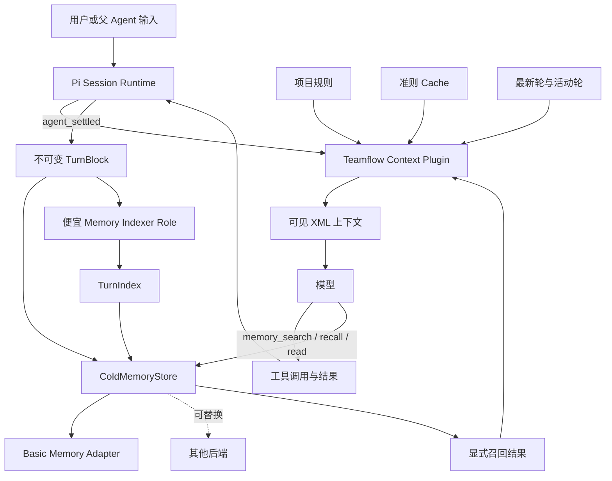

# Teamflow Memory Context Plugin 详细设计

状态：已实现并验证（Phase A–G 全部完成；523 tests / 664 subtests 与全部仓库 gates 通过）

目标分支：`codex/teamflow-memory`

适用范围：Teamflow 基于 Pi 的 planner、执行 Agent、记忆流水线与本地冷记忆基础设施

## 1. 背景与结论

传统 Agent 会持续追加用户消息、模型回复、工具调用和工具结果，在上下文接近上限时再 compact。该模式会造成注意力污染，并通过反复摘要逐步丢失早期约束、失败证据和细微语义；它还会掩盖任务拆分过大的规划问题。

本设计确立以下结论：

1. Teamflow 不使用 compact。
2. Pi 继续维护原生 session 和 JSONL，Teamflow 不替换其 session backend。
3. Teamflow plugin 接管发送给模型的业务上下文。
4. 所有 Teamflow 注入内容都以可见、可审计的 XML custom message 表达。
5. 模型默认看到项目规则、准则 cache、当前子任务契约、最新完整轮、当前活动轮和本轮显式召回内容。
6. 更早轮次逐出热区，原样进入可替换的冷记忆后端。
7. 冷记忆包含不可变原文和可重建的语义索引；摘要只用于检索，不替代原文。
8. 单轮无法在一个上下文预算内完成时，任务必须失败并由 planner 重新拆分。

## 2. 目标与非目标

### 2.1 目标

- 稳定模型上下文大小并提高默认上下文的信息密度。
- 保留最新执行链的完整精度，包括 tool call 与 tool result。
- 独立保存仍然有效的原则、约束、验收标准和已接受决定。
- 支持按时间偏移和语义索引召回完整历史轮次。
- 使冷记忆后端可以从 Basic Memory 替换为 SQLite、对象存储或其他设施。
- 将上下文超限变成可观察、可复用的规划反馈。

### 2.2 非目标

- 不替换 Pi 的 session、模型调用、流式输出或工具协议。
- 不把 Pi JSONL 直接暴露为长期记忆 API。
- 不生成会继续参与推理的滚动任务摘要。
- 不允许 Agent 自行覆盖更高权限来源的规则。
- 不通过扩大模型上下文窗口掩盖任务拆分问题。

## 3. 核心原则

### 3.1 无 compact

Pi 自动 compact 必须通过设置关闭；手工、阈值和溢出 compact 还必须被 hook 拦截，形成配置与运行时双重防线。单轮或召回内容不能容纳时返回结构化失败，不自动摘要、不静默截断、不在原 phase 内重跑完整任务。

### 3.2 遗忘是逐出，不是删除

轮次离开模型上下文后仍然完整存在于冷记忆。热区淘汰不修改、不合并、不摘要原始 TurnBlock。

### 3.3 原文与索引分离

- `TurnBlock` 是不可变事实来源。
- `TurnIndex` 是便宜 role 生成的派生摘要、关键词、实体和向量索引。
- TurnIndex 可以删除和重建；语义搜索先命中索引，再按 block ID 读取原文。

### 3.4 准则 cache 不是 snapshot

准则 cache 只保存仍然有效、不可轻易遗忘的原子信息：项目或角色边界、用户约束、验收标准、已接受决定、明确非目标和安全要求。它不描述完整任务进度，也不替代轮次原文。

### 3.5 无隐藏式业务上下文

Teamflow 不通过隐藏的 system-prompt mutation 添加项目规则、记忆或任务状态。每次注入都形成 `display: true`、参与 LLM context 的 Pi custom message，并列出来源和 hash。

Pi/模型提供方固有的 role system prompt、tool schema 和协议字段继续由 Pi 管理，不属于 Teamflow 业务上下文。

## 4. 总体架构



## 5. 组件边界

### 5.1 Pi 负责

- Agent role 的基础 system prompt。
- Tool schema 与 tool-call/result 协议。
- 模型选择、调用、重试和流式输出。
- 原生 session 创建、恢复、树结构和 JSONL 持久化。
- 进程内消息与事件生命周期。

### 5.2 Context Plugin 负责

- 读取并显式注入项目规则。
- 维护准则 cache。
- 识别轮次边界并投影热区。
- 注册冷记忆读取和检索工具。
- 执行上下文预算检查。
- 禁止 compact。
- 封存 TurnBlock 并触发异步 TurnIndex。
- 生成 context manifest、失败收据和可观察状态。

### 5.3 ColdMemoryStore 负责

- 持久化 TurnBlock 和 TurnIndex。
- 按 block ID 或 session 时间偏移读取原文。
- 按 metadata、全文或语义索引搜索。
- 隔离 repository、task、session 和 agent scope。

## 6. 模型上下文

每次模型调用的业务上下文严格由以下部分组成：

```text
项目规则
+ 准则 cache
+ 当前子任务契约
+ 最新一个已完成轮次的完整原文
+ 当前活动轮次的完整原文
+ 本轮显式召回的冷记忆原文
```

一个轮次从用户或父 Agent 提交输入开始，到 Pi 发出 `agent_settled` 为止，包含所有 assistant 消息、tool call、tool result、provider retry 后的最终事件以及本轮 memory recall 返回。

tool call 与对应 tool result 必须属于同一 TurnBlock，不得被热区逐出逻辑拆开。

### 6.1 滚动规则

1. 执行 `N+1` 时完整保留已完成轮 `N` 和正在发生的 `N+1`。
2. `N+1` settled 后封存为冷记忆。
3. 下一轮只默认保留 `N+1`；`N` 从热区退出。
4. 更早信息需要时通过 memory tool 召回原文。
5. 本轮召回内容属于当前活动轮；下一轮重新按正常规则评估。

## 7. XML 注入协议

```xml
<teamflow_context version="1">
  <context_manifest generated_at="...">
    <source kind="project_rules" ref="AGENTS.md" hash="sha256:..." />
    <source kind="rule_cache" ref="cache://task-123" hash="sha256:..." />
    <source kind="hot_turn" ref="memory://.../turn-124" hash="sha256:..." />
    <source kind="recalled_turn" ref="memory://.../turn-119" hash="sha256:..." />
  </context_manifest>
  <project_rules>...</project_rules>
  <rule_cache>...</rule_cache>
  <task_contract>...</task_contract>
  <latest_turn>...</latest_turn>
  <recalled_turns>...</recalled_turns>
</teamflow_context>
```

要求：

- 使用参与 LLM context 的 Pi custom message，且 `display: true`。
- 注入消息写入 Pi session，UI、JSON 模式和审计工具均可观察。
- `context` hook 可以选择和移除历史，但必须在 manifest 中报告实际投影。
- 禁止在 `before_agent_start` 中拼接隐藏业务 system prompt。
- 所有动态内容做 XML entity escaping；默认不使用 CDATA。
- 属性值必须经过 schema 校验；XML 无法解析时停止该轮。

每次用户或父 Agent 发起新轮时，`before_agent_start` 持久化一个新的
`teamflow_context` custom message。之后同一轮的每次模型调用都由 `context`
hook 从 Pi 提供的消息深拷贝中构造投影：保留本轮最新的 context message、当前
活动消息和本轮召回结果，并移除旧轮 context message 与已逐出的业务历史。旧消息
仍留在 Pi JSONL 中供审计和恢复，不会因为投影过滤而被删除，也不会重复发送给模型。

## 8. Pi Hook 设计

本设计以当前仓库最低支持且已在本机核对的 Pi `0.82.1` 为接口基线。该版本已经提供：

- `--no-context-files`，关闭 `AGENTS.md`/`CLAUDE.md` 自动发现。
- `before_agent_start`，返回持久化且参与 LLM context 的 custom message。
- `context`，在每次 LLM 调用前非破坏性替换消息投影。
- `agent_settled`，表示自动重试、compact/retry 和 follow-up 均已结束。
- `session_before_compact`，区分 `manual`、`threshold`、`overflow` 并允许取消。
- `session_compact`，用于检测不应发生的 compact。

`pi-runtime` 应显式加载 plugin，使用 `--no-context-files` 防止 Pi 自动注入项目
context files，并在 Teamflow 专用 Pi settings 中设置
`compaction.enabled=false`。plugin 仍注册 `session_before_compact`，以阻止手工
`/compact`、防御配置漂移，并把触发原因写入失败收据。

| Pi event/hook | Teamflow 行为 |
| --- | --- |
| `session_start` | 恢复 scope、准则 cache 引用和最近 TurnBlock 元数据 |
| `before_agent_start` | 构造并写入可见 XML context message |
| `context` | 每次 LLM 调用只投影最新 XML context、允许的热轮次、活动链和本轮召回内容；不修改 session 原文 |
| `tool_result` | 记录事件和 token 估算；不摘要、不静默截断当前轮结果 |
| `agent_settled` | 封存 TurnBlock、应用合法 cache delta、启动异步索引 |
| `session_before_compact` | 对 manual/threshold/overflow 一律取消并生成收据；overflow 转为预算失败 |
| `session_compact` | 若仍发生，报告 runtime invariant violation |
| `session_shutdown` | flush 写入状态；未完成不得伪造成功 |

`session_before_compact` 的取消只证明 Pi 不会执行本次 compact；Teamflow 仍需在
provider 调用前自行完成预算检查，确保超限在请求发出前稳定转换为
`CONTEXT_BUDGET_EXCEEDED`，而不是依赖 provider 溢出后再恢复。

## 9. 准则 Cache

```xml
<rule_cache version="1" task_id="task-123">
  <rule
    id="rule-12"
    key="context.no_compaction"
    kind="constraint"
    authority="user"
    status="active"
    scope="task"
    source="memory://.../turn-18#user-1"
  >
    单轮超限视为规划粒度错误，不得 compact。
  </rule>
</rule_cache>
```

Agent 每轮只提出增量：

```xml
<memory_delta>
  <assert>
    <rule key="context.no_compaction" kind="constraint"
          authority="user" scope="task" source="turn-18:user-1">
      正常任务不得使用 compact。
    </rule>
  </assert>
  <supersede />
  <retire />
</memory_delta>
```

规则：

- 旧规则不会因为本轮未提及而消失。
- 权限顺序为 repository/system policy、用户明确指令、accepted planner decision、verified tool evidence、agent candidate。
- 低权限来源不得覆盖高权限规则。
- 用户规则只能被用户后续明确指令 supersede。
- 推断内容只能进入 `candidate`。
- tool evidence 必须引用原始事件。
- `finish=length`、失败或结构不完整的返回不应用模型提出的 delta。

## 10. Agent 结构化返回

```xml
<teamflow_result version="1">
  <status>PASS</status>
  <outcome>...</outcome>
  <artifacts>
    <artifact ref="..." hash="sha256:..." />
  </artifacts>
  <verification>
    <command status="PASS">...</command>
  </verification>
  <open_questions />
  <memory_delta>...</memory_delta>
</teamflow_result>
```

它是预定义的 phase handoff，不是 compact，也不尝试代表完整历史；完整历史仍在 TurnBlock 中。

## 11. 冷记忆模型

### 11.1 TurnBlock

```xml
<teamflow_turn version="1" id="turn-124" sequence="124"
  previous="turn-123" repository="teamflow" task_id="task-123"
  session_id="session-1" agent="planner" started_at="..."
  settled_at="..." content_hash="sha256:...">
  <messages>
    <message id="user-1" role="user">...</message>
    <message id="assistant-1" role="assistant">...</message>
    <tool_call id="call-1" name="...">...</tool_call>
    <tool_result call_id="call-1" status="ok">...</tool_result>
  </messages>
</teamflow_turn>
```

TurnBlock 创建后不可修改。纠错通过新 block、索引修订或显式 supersession 完成。

### 11.2 TurnIndex

```xml
<teamflow_turn_index version="1" block_id="turn-124">
  <intent>...</intent>
  <actions>...</actions>
  <outcomes>...</outcomes>
  <decisions>...</decisions>
  <constraints>...</constraints>
  <failures>...</failures>
  <open_questions>...</open_questions>
  <keywords>...</keywords>
  <entities>...</entities>
  <artifact_refs>...</artifact_refs>
  <source_events>...</source_events>
</teamflow_turn_index>
```

TurnIndex 由便宜的 `memory-indexer` role 异步生成。每项语义结论必须引用原始事件。索引失败不阻塞主任务，按 block ID 或偏移读取仍可用。

## 12. 冷记忆接口

```typescript
interface ColdMemoryStore {
  writeTurn(turn: TurnBlock): Promise<MemoryRef>;
  writeIndex(index: TurnIndex): Promise<void>;
  readTurn(ref: MemoryRef): Promise<TurnBlock>;
  readByOffset(scope: SessionScope, before: number, count?: number): Promise<TurnBlock[]>;
  search(query: string, scope: MemoryScope, options?: SearchOptions): Promise<SearchHit[]>;
}
```

Plugin 只能依赖该接口，不能在 context lifecycle 中直接拼装 Basic Memory CLI 参数。

## 13. Basic Memory Adapter

当前已核对的 Basic Memory `0.22.1` 是首个冷记忆后端，不是 plugin 协议的一部分。它使用 Markdown 文件作为真源、YAML frontmatter 保存 metadata、SQLite 保存可重建索引。

建议目录：

```text
~/.teamflow/memory/knowledge/projects/<repository>/
├── turns/<session-id>/<sequence>-<turn-id>.md
├── turn-index/<session-id>/<sequence>-<turn-id>.md
└── planning-experience/<experience-id>.md
```

Turn note 示例：

```markdown
---
title: Turn 124
type: teamflow_turn
permalink: projects/teamflow/turns/session-1/000124
session_id: session-1
task_id: task-123
agent: planner
sequence: 124
previous: projects/teamflow/turns/session-1/000123
content_hash: sha256:...
---

<teamflow_turn version="1" id="turn-124">
  ...
</teamflow_turn>
```

适配规则：

- 原始 turn note 与派生 index note 分开。
- 时间偏移由 adapter 根据 `session_id + sequence` 实现。
- metadata 强制 repository/task/session/agent scope。
- 全文检索搜索 TurnIndex；vector/hybrid 仅在本地 embedding 已安装并完成索引后启用。
- 语义搜索只返回候选摘要和 block ID，完整历史必须再次 exact read。
- Pi JSONL 是运行时 trace；Basic Memory TurnBlock 是 Teamflow 冷记忆表示；二者通过 entry 范围和 hash 关联。

## 14. 模型记忆工具

```text
memory_recall(before=1, count=1)
memory_search(query="禁止 compact 的决定", limit=5)
memory_read(block_id="turn-124")
```

- `memory_recall` 按相对时间偏移返回完整原文，内部先解析为稳定 block ID。
- `memory_search` 只返回 block ID、时间、scope、摘要、相关度和命中字段。
- `memory_read` 返回完整原文，并将其作为当前活动轮的一部分保留到 settled。

## 15. 热区逐出

1. 项目规则和准则 cache 永不逐出。
2. 当前活动轮永不逐出。
3. 最新完整轮默认保留。
4. 更早完整轮退出热区。
5. tool call/result 因果对不可拆分。
6. 本轮召回内容保留到本轮结束。
7. 不根据模型生成的相关度悄悄删除当前轮消息。

## 16. 预算与失败

```text
可用 context window
- Pi 基础 system/tool schema
- 项目规则
- 准则 cache
- 最新完整轮
- 当前响应预留
= 当前活动轮与 recall 的预算
```

阈值按模型窗口动态计算，不使用跨模型固定 token 数。

单轮超限：

```xml
<teamflow_failure version="1">
  <status>BLOCKED</status>
  <reason>CONTEXT_BUDGET_EXCEEDED</reason>
  <phase>implementation</phase>
  <turn_ref>memory://.../turn-124</turn_ref>
  <budget limit="..." used="..." remaining="..." />
  <largest_sources>
    <source kind="tool_result" ref="turn-124#tool-result-7" tokens="..." />
  </largest_sources>
  <required_action>REPLAN_AND_SPLIT</required_action>
</teamflow_failure>
```

完整 recall 无法装入剩余预算时返回 `RECALL_BUDGET_EXCEEDED`。模型可以缩小 count、先 search，或要求新调查 phase；不得以摘要冒充请求的原文。

## 17. 规划经验闭环

```text
原 phase 超限
→ 结构化失败收据
→ planner 重新拆分
→ 新 phases 独立完成并验证
→ 比较失败和成功拆分
→ 写入 verified planning experience
```

单次超限只生成候选。只有新拆分全部通过验证后，才能记录失败任务形状、最大 token 来源、失败策略、成功拆分、block 引用和 PASS 证据。

## 18. 多 Agent 隔离

- 每个 Pi 子进程拥有独立 session 和热区。
- 子 Agent 不继承 planner 完整历史。
- handoff 显式携带任务契约、适用规则和 artifact refs。
- 子 Agent 返回 `teamflow_result`；父 Agent 需要细节时通过 block ref 召回。
- 跨 Agent 共享准则时传递带 authority/source 的只读集合，不共享可变内存对象。

## 19. 安全与完整性

1. 密钥、凭证、私有用户数据和未授权敏感内容不得进入冷记忆。
2. 工具应避免输出 secrets；安全过滤优先于原文完整性。
3. TurnBlock 保存前计算 hash，读取时验证并在 manifest 报告。
4. XML 动态内容严格转义，防止记忆正文注入控制标签。
5. 语义摘要不得获得高于原始来源的 authority。
6. 冷记忆写入失败必须报告 `MEMORY_PERSISTENCE_FAILED`，不能声称已保存。

## 20. 可观察性

每轮至少记录：

- context manifest、来源和 hash。
- 热区包含和逐出的 turn IDs。
- recall 调用及返回 block IDs。
- 预算 limit/used/remaining。
- TurnBlock 写入状态。
- TurnIndex 的 pending/ready/failed 状态。
- compact 拦截事件。

外层协调继续只读取结构化 phase/session 元数据和约定 artifact，不读取隐藏 reasoning、凭证或未授权 session 内容。

## 21. 配置草案

```text
TEAMFLOW_CONTEXT_PLUGIN_ENABLED=true
TEAMFLOW_CONTEXT_VISIBLE_XML=true
TEAMFLOW_CONTEXT_NO_COMPACTION=true
TEAMFLOW_CONTEXT_KEEP_COMPLETED_TURNS=1
TEAMFLOW_COLD_MEMORY_PROVIDER=basic-memory
TEAMFLOW_MEMORY_INDEXER_ROLE=memory-indexer
TEAMFLOW_MEMORY_SEMANTIC_SEARCH=false
```

关闭 plugin 时不得悄悄恢复隐藏注入和自动 compact，必须显式报告运行模式。

## 22. 实施阶段

### A. 观察模式

监听 hook 但不改变上下文；生成 manifest、turn boundary 和预算报告，校验 tool 因果对与 session 恢复。

状态：已实现。运行时实现遵循本设计：扩展注册 `session_start` / `before_agent_start` / `tool_call` / `tool_result` / `agent_settled` hook，仅观察不修改上下文；`agent_settled` 计算 SHA-256 观察 manifest（systemPromptHash、contextMessagesHash、manifestHash），校验 tool call / tool result 因果配对并报告 unmatchedCalls / unmatchedResults，通过 `getContextUsage()` 记录预算观测值（只记录、不参与控制），每轮恰好追加一条不可变 `teamflow:observation` 回执；`session_start` 从本会话最新观察回执恢复 turn 计数，保证 reload 后轮次序列连续而非从零重启。

### B. 冷记忆

引入 `ColdMemoryStore` 与 Basic Memory adapter；保存 TurnBlock 和 hash，实现 block ID/offset 读取。

状态：已实现。运行时实现遵循本设计：`cold-memory-store.ts` 定义可替换的 `ColdMemoryStore` 接口（writeTurn / readTurn / readByOffset 及 SessionScope / MemoryRef 类型）；默认后端 `FileColdStore` 将不可变 XML TurnBlock 写入独立冷存储目录（`<root>/<repository>/turns/<sessionId>/`，root 可由 `TEAMFLOW_COLD_MEMORY_ROOT` 覆盖，默认 `~/.teamflow/memory/state/cold-store/`），不写入 Basic Memory knowledge 树；写入为原子写（临时文件 + rename）、同 hash 幂等、不同 hash 报 Hash conflict，读取时重算规范 SHA-256 content hash 校验完整性，`readByOffset` 按 sequence 降序实现时间偏移读取；`agent_settled` 从当前轮 session entries 构建完整 TurnBlock（元数据 + 经 `redactSecrets()` 脱敏的 user/assistant/toolResult 消息），并追加一条 `teamflow:cold_memory_persistence` 回执——成功为 status persisted 附 store ref，失败为 status failed 附 `MEMORY_PERSISTENCE_FAILED`，绝不伪造成功。

### C. 可见 XML

启用 `--no-context-files`；plugin 显式加载规则并注入 XML；验证模型上下文与 manifest 一致。

状态：已实现。运行时实现遵循本设计：`pi-runtime` 以 `--no-context-files` 启动 Pi，使 AGENTS.md 不再被自动拼入隐藏 system prompt；`before_agent_start` 显式读取 AGENTS.md 并返回 `display: true` 的 `teamflow:context` custom message，内容包含 `<teamflow_context>` XML 与 `<context_manifest>`，逐条列出来源 kind、ref 与 SHA-256 hash；动态内容经 XML entity escaping，缺失 AGENTS.md 时生成空 `<project_rules>` 段而非报错；不发生任何隐藏 systemPrompt 拼接，manifest 与注入内容一一对应。

### D. 热区接管与禁用 compact

只保留最新完整轮和活动轮，拦截 compact，启用预算失败协议。

状态：已实现。运行时实现遵循本设计：`context` hook 执行热区投影（保留最新 `teamflow:context` 规则消息、最近完成轮与活动轮，逐出更早轮次且不生成替代文本，不拆散 tool 因果对）；`session_before_compact` 对所有 reason 返回 `{ cancel: true }` 并记录 `teamflow:compact_intercepted` 回执，`session_compact` 记录 `teamflow:compact_violation` 不变量违例回执；`.teamflow/settings.json` 声明 `compaction.enabled=false`；预算超限时追加 `CONTEXT_BUDGET_EXCEEDED` 结构化失败回执。

### E. 准则 cache

实现 XML schema、authority reducer 与 `memory_delta`；验证遗漏不删除旧规则、低权限不能覆盖高权限。

状态：已实现。运行时实现遵循本设计：`rule-cache.ts` 定义 Rule/RuleCache/MemoryDelta schema、`<rule_cache>` 规范 XML 序列化（SHA-256 content hash，hash 输入排除 content_hash 字段）与 `<memory_delta>` 增量格式（assert / supersede / retire）及 `validateDelta()` 结构校验；`rule-cache-reducer.ts` 的 `applyDelta()` 是纯且全函数的权限感知 reducer——未提及规则保持不变，低权限不能覆盖高权限，candidate 推断仅以 candidate 状态进入，tool_evidence 空 source 被拒绝，supersede/retire 保留旧规则供审计；扩展在 `before_agent_start` 注入可见 `<rule_cache>` 段与 manifest 来源，`agent_settled` 仅在非 finish=length、状态 PASS、delta 结构有效时应用并以 `teamflow:rule_cache` 条目持久化，`session_start` 恢复前验证规范 hash。

### F. 语义索引

增加便宜 `memory-indexer` role；先实现全文 search，再选择性启用本地 vector/hybrid search。

状态：已实现。运行时实现遵循本设计：`turn-index.ts` 定义 TurnIndex schema 与 `SemanticEntry`/`IndexSourceRef` 源引用类型，提供规范 XML 序列化（固定属性顺序、实体转义、SHA-256 content hash，hash 输入排除 content_hash 字段）与 `validateIndex()`（先结构校验后 hash 校验）；`ColdMemoryStore` 接口新增 `writeIndex`/`search` 契约及 `MemoryScope`/`SearchHit`/`SearchOptions` 类型；`FileColdStore` 实现幂等索引写入（同 hash 幂等返回、不同 hash 报 Hash conflict、原子写入，索引存放于 `<root>/<repo>/turn-index/<sessionId>/`）与确定性全文检索（分词子串匹配计分、范围过滤、按 blockId 去重、分数降序/sequence 升序稳定排序、limit 截断，`blockRef` 始终指向 turns/ 原始块路径）；新增 `memory-indexer` 角色（MiMo 2.5 Pro），仅写 `.teamflow/runs/memory/` 或冷存储索引目录。vector/hybrid search 尚未启用，后续按本设计选择性接入。

### G. 规划反馈

将 budget failure 接入 phase 收据；只在新拆分验证成功后写入规划经验。

状态：已实现。`phase_state.py` 的 `finish` 子命令接受 `--block-reason`（CONTEXT_BUDGET_EXCEEDED / RECALL_BUDGET_EXCEEDED）及 limit/used/remaining、protected_component、requiredAction=REPLAN_AND_SPLIT、largest_sources、source_refs 结构化预算失败元数据，生成确定性 phase BLOCKED 收据；`start` 子命令接受 `--parent-run-id`/`--parent-phase`/`--split-scope` 用于重拆分 lineage 追踪；新增 `planning-experience` 子命令仅在新拆分所有子 phase 验证 PASS 后生成规划经验，任何失败/部分成功/RUNNING/空集均 deferred 不写。扩展的 CONTEXT_BUDGET_EXCEEDED 回执增加 largestSources 与 protectedComponent 字段，新增 RECALL_BUDGET_EXCEEDED 回执类型。

## 23. 验收标准

### 可见上下文

- Pi 不自动加载项目 context files。
- Teamflow 业务上下文全部出现在可见 XML custom message。
- manifest 列出每个来源及 hash。
- 不存在隐藏业务 system-prompt 拼接。

### 热区与无 compact

- 每次调用保留当前活动轮和最近完整轮。
- tool call/result 不拆开。
- 更早历史不发送给模型，但可以 exact recall。
- 自动和手工 compact 均被阻止。
- 超限返回 BLOCKED，不发生 compact-and-retry。

### 准则 cache

- 未在新轮提及的旧规则不会消失。
- 用户规则不能被低权限 Agent 覆盖。
- 无来源规则不能晋升为 active。
- cache 在历史逐出后仍注入模型。

### 冷记忆与召回

- TurnBlock 不可变且 hash 可验证。
- Basic Memory adapter 支持写、读、offset 读取。
- TurnIndex 可删除重建。
- 替换 mock/in-memory provider 不影响 plugin 协议。
- search 只返回候选，read/recall 返回精确原文。
- 召回超限返回明确失败，不摘要、不截断。

### 规划反馈

- 单轮超限结束当前 phase。
- planner 收到最大 token 来源和 artifact refs。
- 重新拆分在新 phase 中进行。
- 未验证建议不写入长期规划经验。

## 24. 待确认参数

1. 每个模型的响应预留比例和软预警阈值。
2. 准则 cache 的 task/project 生命周期和最大字符数。
3. `memory-indexer` 的具体便宜模型及最小 context window。
4. Basic Memory TurnBlock 的最终命名和 permalink 规范。
5. semantic search 的本地 embedding 模型与索引策略。
6. recall 原文在 Pi UI 中默认展开还是折叠。
7. memory persistence 失败时哪些 phase 可继续，哪些必须 BLOCKED。

## 25. 架构结论

Teamflow 将任务复杂度交给 planner 拆分，将上下文容量交给冷热分层，将长期约束交给受保护的准则 cache，将历史检索交给可替换的冷记忆设施。

Pi session 保持原生；Teamflow plugin 接管模型可见的业务上下文；Basic Memory 作为首个冷记忆后端，但不成为不可替换的协议依赖。

系统不使用 compact。无法在单个上下文预算内完成的子任务必须失败、重新拆分，并在成功验证后把更合理的拆分方式沉淀为规划经验。
